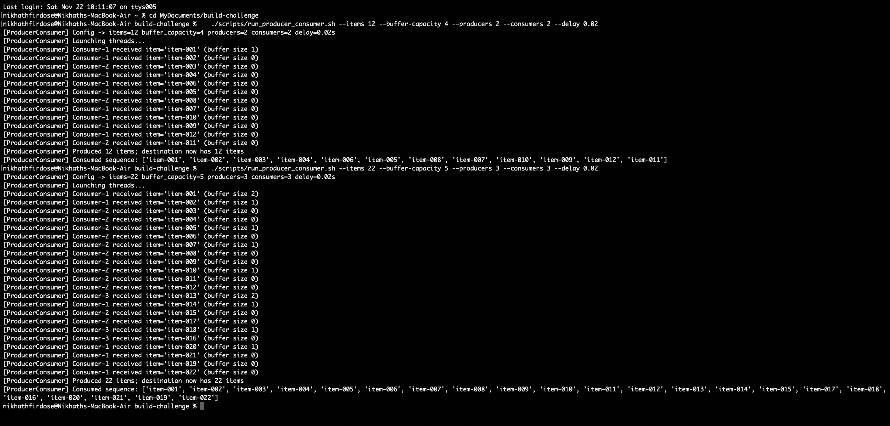
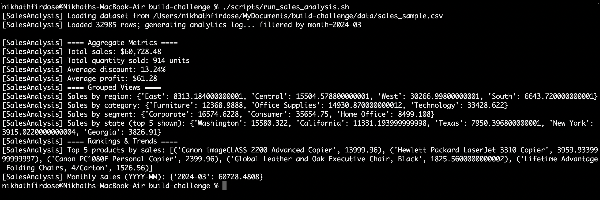
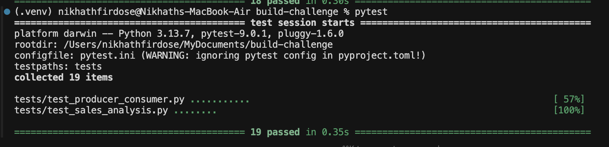

# Build Challenge – Producer-Consumer & Sales Analysis

## Project Overview

This repository delivers two production-style Python assignments, built to demonstrate concurrency, data engineering, and testing best practices:

- **Producer–Consumer Concurrency** – a bounded blocking buffer orchestrates a producer thread pulling from a source container and a consumer thread pushing into a destination container. It showcases explicit wait/notify synchronization and deterministic shutdown.
- **Sales CSV Analytics** – functional-style data processing over a Superstore dataset, including aggregation, grouping, ranking, and summary metrics. A CLI runner prints human-friendly insights.

### Key Features & Deliverables

- **Complete Python source** for both assignments under `src/`.
- **Bounded buffer implementation** with producer/consumer threads, configurable capacity, and descriptive logging.
-  **Functional analytics suite** covering totals, averages, grouped aggregations, rankings, and monthly summaries.
- **Unit tests** (`pytest`) for every analytics function and the producer–consumer workflow.
- **Rich CLI logs** that can be shared with teammates; piping via `tee` captures the full narrative and fulfills the “print all analyses to console” requirement.
- **README documentation** with setup, execution instructions, dataset schema, and sample outputs.
-  **Dataset provenance**: Superstore Dataset 2014–2024 from Kaggle (see link below).

## Tech Stack

- Python 3.10+
- Standard library: `threading`, `collections`, `dataclasses`, `csv`, `itertools`, `statistics`, `pathlib`, `typing`
- Testing: `pytest`

## Project Structure

```
project_root/
├── data/
│   └── sales_sample.csv        # Sample dataset used by analytics and tests
├── src/
│   ├── producer_consumer/
│   │   ├── buffer.py           # Bounded buffer with Condition-based wait/notify
│   │   ├── consumer.py         # Consumer thread draining the buffer
│   │   ├── producer.py         # Producer thread filling the buffer
│   │   └── runner.py           # Demo wiring producer + consumer
│   └── sales_analysis/
│       ├── analytics.py        # Functional aggregations
│       ├── models.py           # SaleRecord dataclass
│       ├── reader.py           # CSV deserializer
│       └── runner.py           # CLI runner printing all analyses
├── tests/
│   ├── test_producer_consumer.py
│   └── test_sales_analysis.py
├── pyproject.toml
├── requirements.txt
└── README.md
```

## Setup & Installation

```bash
python3 -m venv .venv
source .venv/bin/activate  # Linux/macOS
pip install -r requirements.txt
```

## Running the Demos

### Producer–consumer demo:

```bash
python -m src.producer_consumer.runner
```

Optional flags let you explore different workloads without editing code:

- `--items`: total number of payload items to move from producer(s) to consumer(s).
- `--buffer-capacity`: the bounded buffer size (demonstrates blocking when full).
- `--producers`: number of producer threads.
- `--consumers`: number of consumer threads.
- `--delay`: optional sleep (seconds) after each `put`; useful to visualize interleaving.


```bash
python -m src.producer_consumer.runner --items 30 --buffer-capacity 6 --producers 2 --consumers 3 --delay 0.0
```

Helper script (runs with a baked-in 50-item scenario if no args are provided):

```bash
./scripts/run_producer_consumer.sh
```

Pass any of the flags above to override the defaults:

```bash
./scripts/run_producer_consumer.sh --items 30 --buffer-capacity 6 --producers 2 --consumers 3 --delay 0.0
```

### Sales analysis demo:

```bash
python -m src.sales_analysis.runner
```

Optional flags let you tailor the analytics output:

```bash
python -m src.sales_analysis.runner --top-n 3 --month 2024-01
```

Helper script (runs a March 2024 + top 5 snapshot if no args are provided):

```bash
./scripts/run_sales_analysis.sh
# or pass your own flags:
./scripts/run_sales_analysis.sh --top-n 3 --month 2024-01
```

### Capturing sharable CLI logs

Pipe the demo output through `tee` so you can paste the transcript into chat/email:

```bash
mkdir -p logs
python -m src.producer_consumer.runner | tee logs/producer_consumer.log
python -m src.sales_analysis.runner | tee logs/sales_analysis.log
```

## Running Tests

```bash
pytest
```

## CSV Dataset & Functional Analytics

Assignment 2 operates on the provided `data/sales_sample.csv` file (a Superstore-style extract).  
The dataset is not modified by the application; it is read as-is and converted into typed `SaleRecord`
instances using only the Python standard library. All analytics functions are pure and rely on
generator expressions, comprehensions, and utilities such as `sum`, `sorted`, and `itertools.groupby`.

Dataset source: [Superstore Dataset 2014–2024 (Kaggle)](https://www.kaggle.com/datasets/mananapatel99/superstore-dataset-2014-2024)

### Dataset Schema (columns appear exactly as in the CSV)

| Column Name      | Type    | Notes                                   |
|------------------|---------|-----------------------------------------|
| Row ID           | string  | Unique row identifier (kept as string)  |
| Order ID         | string  | Sales order identifier                  |
| Order Date       | date    | Parsed from `MM/DD/YY` format           |
| Ship Date        | date    | Parsed from `MM/DD/YY` format           |
| Ship Mode        | string  | Fulfillment speed                       |
| Customer ID      | string  | Unique customer code                    |
| Customer Name    | string  | Customer full name                      |
| Segment          | string  | Customer segment (Consumer, etc.)       |
| Country          | string  | Country/region descriptor               |
| City             | string  | City                                    |
| State            | string  | US/CA state or province                 |
| Postal Code      | string  | Stored as string to preserve leading 0s |
| Region           | string  | Sales region                            |
| Product ID       | string  | SKU identifier                          |
| Category         | string  | Top-level category                      |
| Sub-Category     | string  | Subcategory label                       |
| Product Name     | string  | Human-readable product name             |
| Sales            | float   | Revenue for the line item (USD)         |
| Quantity         | int     | Units sold                              |
| Discount         | float   | Fractional discount (0–1)               |
| Profit           | float   | Profit contribution (USD)               |

Analytics exposed via `src/sales_analysis/analytics.py`:

- `total_sales`
- `sales_by_region`
- `sales_by_category`
- `sales_by_segment`
- `sales_by_state`
- `total_quantity_sold`
- `average_discount`
- `average_profit`
- `top_n_products_by_sales`
- `monthly_sales`

All functions accept iterables of `SaleRecord` and return new values without side effects.

## Sample Output Screenshots


*Producer–consumer helper script showing a 15-item run (2 producers, 3 consumers).*


*Sales analysis helper script filtered to March 2024 with the top five products.*


*Test Cases*

